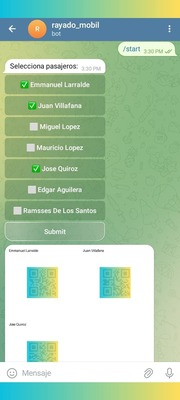

# QR code aggregating bot

A bot designed to generate an image with multiple qr images.

## How to use

1. Install dependencies

```bash
pip install -r requirements.txt
```

2. Add Telegram key

Replace `BOT_TOKEN` in `src/my_secrets.py`

3. Run

```python
python src/bot.py
```

4. Enjoy!

Open your bot on telegram and start chatting.


